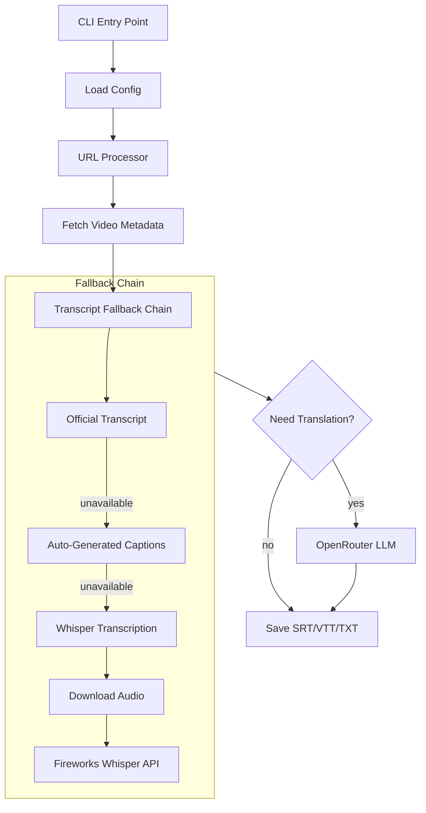

# yt CLI Tool Implementation Plan

## Architecture Overview



## Project Structure

```
yt/
├── pyproject.toml          # Package config with CLI entry point
├── src/
│   └── yt/
│       ├── __init__.py
│       ├── __main__.py     # Entry point: python -m yt
│       ├── cli.py          # Argument parsing (click)
│       ├── config.py       # YAML config loading
│       ├── youtube.py      # Metadata & transcript fetching (yt-dlp)
│       ├── transcribe.py   # Whisper via Fireworks API
│       ├── translate.py    # LLM translation via OpenRouter
│       ├── formatter.py    # SRT/VTT/TXT output formatting
│       └── utils.py        # Helpers (file naming, language codes)
└── README.md
```

## Key Dependencies

| Package | Purpose |

|---------|---------|

| `click` | CLI argument parsing |

| `yt-dlp` | YouTube metadata, transcripts, audio download, cookies |

| `httpx` | Async HTTP for Fireworks & OpenRouter APIs |

| `pyyaml` | Config file parsing |

| `rich` | Beautiful terminal output and progress bars |

## Implementation Details

### 1. CLI Entry Point (`cli.py`)

- Use `click` for argument parsing matching the README spec
- Support positional URLs, `--input` file, all flags from CLI Reference table
- Entry point registered in `pyproject.toml` as `yt = "yt.cli:main"`

### 2. Config Loading (`config.py`)

- Load from `~/.config/yt/config.yaml` or `--config` path
- Expand `~` in paths
- Merge CLI arguments over config defaults
- Read API keys from environment variables specified in config

### 3. YouTube Integration (`youtube.py`)

- Use `yt-dlp` library to:
  - Fetch video metadata (title, upload date, video ID)
  - Extract official/auto-generated subtitles in target languages
  - Download audio (m4a) when Whisper fallback needed
  - Handle cookies via `--cookies` or `--cookies-from-browser`
  - Support `--player-client` for compatibility

### 4. Whisper Transcription (`transcribe.py`)

- POST audio to Fireworks API endpoint
- Parse response into timestamped segments
- Return structured transcript data

### 5. LLM Translation (`translate.py`)

- Batch transcript segments for context
- Call OpenRouter API with translation prompt
- Preserve timestamp structure in output

### 6. Output Formatting (`formatter.py`)

- Generate SRT format (numbered entries with timestamps)
- Generate VTT format (WebVTT header + cues)
- Generate TXT format (plain text, no timestamps)
- File naming: `{YYYY-MM-DD} - {Video Title} [{language}].{ext}`

## Installation

After implementation, install globally with:

```bash
cd yt
pip install -e .
```

Or for a clean install:

```bash
pip install .
```

The `yt` command will then be available system-wide.