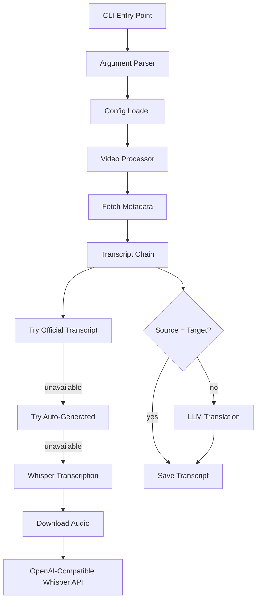

# Build yt CLI Tool

## Architecture Overview



## Project Structure

```
yt/
├── pyproject.toml          # Package config with uv/pip entry point
├── src/
│   └── yt/
│       ├── __init__.py
│       ├── __main__.py     # Entry point for `python -m yt`
│       ├── cli.py          # Argument parsing (argparse)
│       ├── config.py       # YAML config loading + defaults
│       ├── youtube.py      # yt-dlp wrapper for metadata/audio/captions
│       ├── transcript.py   # Transcript fetching with fallback chain
│       ├── whisper.py      # OpenAI-compatible Whisper API client
│       ├── translate.py    # OpenAI-compatible LLM translation
│       ├── formatter.py    # SRT/VTT/TXT output formatting
│       └── utils.py        # File naming, path expansion, helpers
└── README.md
```

## Key Implementation Details

### 1. Dependencies

- `yt-dlp` - YouTube metadata, audio download, caption extraction
- `httpx` - HTTP client for Whisper and LLM APIs
- `pyyaml` - Config file parsing
- `rich` - Pretty console output and progress bars

### 2. Config File (`~/.config/yt/config.yaml`)

Updated to be provider-agnostic with OpenAI-compatible endpoints:

```yaml
languages:
  - en
  - ja

storage:
  audio_dir: "~/YouTube Subtitles/Audio"
  transcript_dir: "~/YouTube Subtitles/Transcripts"

# OpenAI-compatible Whisper API
transcription:
  base_url: https://api.openai.com/v1/audio/transcriptions
  model: whisper-1
  api_key_env: OPENAI_API_KEY

# OpenAI-compatible Chat API for translation
llm:
  base_url: https://api.openai.com/v1/chat/completions
  model: gpt-4o
  api_key_env: OPENAI_API_KEY
```

### 3. Transcript Fallback Chain (`transcript.py`)

1. Use `yt-dlp` to list available subtitles
2. Try fetching official (manual) transcript in requested language
3. Fall back to auto-generated captions
4. If unavailable, download audio and transcribe via Whisper API

### 4. Whisper Client (`whisper.py`)

Generic OpenAI-compatible client that works with:

- OpenAI's Whisper API
- Fireworks AI
- Groq
- Any OpenAI-compatible audio transcription endpoint

### 5. LLM Translation (`translate.py`)

Generic OpenAI-compatible chat client for translation that works with:

- OpenAI
- OpenRouter
- Ollama
- Any OpenAI-compatible chat completions endpoint

### 6. Global Installation

Using `uv tool install`:

```bash
cd yt
uv tool install .
```

This installs `yt` command globally in an isolated environment.

## Implementation Steps

1. **Set up project structure** - Create `pyproject.toml` with dependencies and entry point
2. **Implement config loader** - YAML parsing with defaults and path expansion
3. **Build YouTube wrapper** - yt-dlp integration for metadata, captions, audio
4. **Create Whisper client** - Generic OpenAI-compatible transcription
5. **Create LLM client** - Generic OpenAI-compatible translation
6. **Implement transcript chain** - Fallback logic with all three methods
7. **Add output formatters** - SRT, VTT, and plain text generation
8. **Build CLI interface** - argparse with all options from README
9. **Add batch processing** - Handle multiple URLs and input files